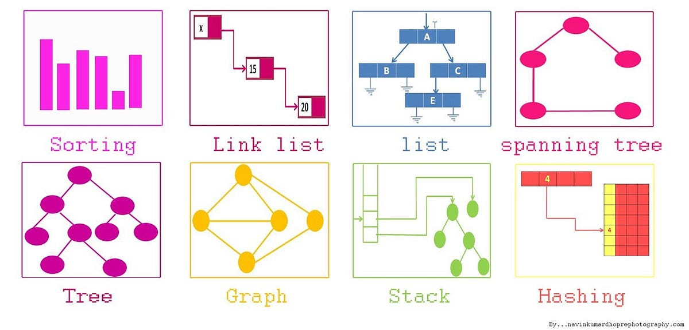

# Comprehensive Data Structures and Algorithms in Python

Welcome to the Comprehensive Data Structures and Algorithms in Python repository by Muhammad Sheraz. This repository is designed to be a comprehensive and advanced resource, offering an in-depth understanding of data structures and algorithms, aimed at helping you excel in technical interviews and compete for positions at FAANG (Facebook, Apple, Amazon, Netflix, Google) and other top-tier tech companies.

  
  
  

## Table of Contents

- [Introduction](#introduction)
- [Why Data Structures and Algorithms Matter](#why-data-structures-and-algorithms-matter)
- [Data Structures](#data-structures)
  - [Lists](#lists)
    - [Lists implemntation by Array](#Lists-implemntation-by-Arrays)
    - [Lists implemntation by Linked Lists](#Lists-implemntation-by-Linked-Lists)
  - [Arrays](#arrays)
  - [Stacks](#stacks)
  - [Queues](#queues)
  - [Linked Lists](#linked-lists)
    - [Singly Linked Lists](#Singly-Linked-Lists)
    - [Doubly Linked Lists](#Doubly-Linked-Lists)
    - [Circular Linked Lists](#Circular-Linked-Lists)
  - [Trees](#trees)
    - [Binary Trees](#binary-trees)
    - [Binary Search Trees (BST)](#binary-search-trees-bst)
    - [AVL Trees](#avl-trees)
  - [Heaps](#heaps)
    - [Min and Max Heaps](#min-and-max-heaps)
  - [Hash Tables](#hash-tables)
  - [Graphs](#graphs)
    
  - [Algorithms](#algorithms)
   - [Graph Algorithms](#graph-algorithms)
      - [Breadth-First Search (BFS)](#breadth-first-search-bfs)
         - [Breadth-First Search (BFS)](#breadth-first-search-bfs)
         - [Applications of BFS](#applications-of-bfs)
      - [Depth-First Search (DFS)](#depth-first-search-dfs)
         - [Depth-First Search (DFS)](#depth-first-search-dfs)
         - [Applications of DFS](#applications-of-dfs)
      - [Minimum Spanning Trees](#minimum-spanning-trees)
         - [Prim's Algorithm](#prims-algorithm)
            - [Prim's Algorithm](#prims-algorithm)
            - [Prim's Algorithm Variants](#prims-algorithm-variants)
         - [Kruskal's Algorithm](#kruskals-algorithm)
            - [Kruskal's Algorithm](#kruskals-algorithm)
            - [Kruskal's Algorithm Variants](#kruskals-algorithm-variants)
         - [Dijkstra's Algorithm](#dijkstras-algorithm)
            - [Dijkstra's Algorithm](#dijkstras-algorithm)
            - [Dijkstra's Algorithm Variants](#dijkstras-algorithm-variants)
         - [Bellman-Ford Algorithm](#bellman-ford-algorithm)
            - [Bellman-Ford Algorithm](#bellman-ford-algorithm)
            - [Bellman-Ford Algorithm Variants](#bellman-ford-algorithm-variants)

  - [Sorting](#sorting)
    - [Bubble Sort](#bubble-sort)
    - [Selection Sort](#selection-sort)
    - [Insertion Sort](#insertion-sort)
    - [Quicksort](#quicksort)
    - [Mergesort](#mergesort)
  - [Searching](#searching)
    - [Linear Search](#linear-search)
    - [Binary Search](#binary-search)
  - [Dynamic Programming](#dynamic-programming)
    - [Principles of Dynamic Programming](#principles-of-dynamic-programming)
    - [Dynamic Programming Problems](#dynamic-programming-problems)
  - [Greedy Algorithms](#greedy-algorithms)
    - [Introduction to Greedy Algorithms](#introduction-to-greedy-algorithms)
  - [Divide and Conquer](#divide-and-conquer)
    - [Principles of Divide and Conquer](#principles-of-divide-and-conquer)
    - [Divide and Conquer Problems](#divide-and-conquer-problems)
  - [Backtracking](#backtracking)
    - [Backtracking Algorithm](#backtracking-algorithm)
- [How to Use](#how-to-use)
- [Contributing](#contributing)
- [License](#license)

## Data Structures

### Lists

We start our journey into advanced data structures with:

- **Singly Linked Lists**: A linear data structure where each element points to the next element in the sequence. Learn about its structure, operations, and implementations in Python.
- **Doubly Linked Lists**: Similar to singly linked lists but with each node containing a reference to both the next and the previous node. Explore detailed implementations and advanced operations.

### Arrays

- **Arrays**: Fundamental data structure for storing ordered collections of data. Master its operations and intricacies.
- **Array Operations**: Dive deep into common operations like insertion, deletion, and searching within arrays.

### Stacks

- **Basic Stack Operations**: Learn the core operations of stacks such as push, pop, and peek.
- **Implementation Using Lists**: Understand how to implement stacks using Python lists efficiently.

### Queues

- **Basic Queue Operations**: Become proficient in enqueue and dequeue operations.
- **Implementation Using Lists**: Implement queues using Python lists effectively.

### Linked Lists

- **Singly Linked Lists**: Understand the structure and operations of singly linked lists comprehensively.
- **Doubly Linked Lists**: Explore doubly linked lists with detailed implementations and advanced operations.
- **Circular Linked Lists**: Delve into circular linked lists, including their structure and advanced operations.
- **Advanced Linked List Operations**: Master advanced operations and use cases of linked lists.

### Trees

#### Binary Trees

- **Binary Trees**: Learn the concepts and implementations of binary trees.
- **Binary Tree Traversals**: Master in-order, pre-order, and post-order traversals.
- **Binary Tree Properties**: Understand common properties and characteristics of binary trees.
- **Binary Tree Algorithms**: Dive deep into algorithms for common binary tree operations.

#### Binary Search Trees (BST)

- **Binary Search Trees (BST)**: Grasp the concepts of BST and see Python implementations.
- **BST Operations**: Master insertion, deletion, and search operations.
- **Balanced BSTs**: Explore AVL Trees and Red-Black Trees for maintaining balance.

#### AVL Trees

- **AVL Trees**: Understand AVL trees with comprehensive explanations.
- **AVL Tree Operations**: Explore rotation operations and balancing techniques.

### Heaps

#### Min and Max Heaps

- **Min and Max Heaps**: Learn about heaps and their Python implementations.
- **Heap Operations**: Understand heapify, insert, and extract operations thoroughly.
- **Heap Sort**: Delve deep into heap sort with detailed explanations and implementations.

### Hash Tables

#### Hashing Techniques

- **Hashing Techniques**: Explore hashing and hash functions in-depth.
- **Collision Resolution**: Master techniques for resolving collisions in hash tables.

### Graphs

#### Graph Basics

- **Graph Basics**: Understand fundamental concepts like vertices and edges.
- **Graph Representation**: Learn different ways to represent graphs.
- **Graph Traversals**: Master Depth-First Search (DFS) and Breadth-First Search (BFS).

## Algorithms

We cover a wide range of advanced algorithms, including:

### Sorting

#### Bubble Sort

- **Bubble Sort**: Understand the concepts and master Python code.
- **Bubble Sort Variants**: Dive deep into optimized variants and performance analysis.

#### Selection Sort

- **Selection Sort**: Grasp the concepts and explore Python code.
- **Selection Sort Variants**: Explore variations and detailed performance analysis.

#### Insertion Sort

- **Insertion Sort**: Master the concepts and explore Python code.
- **Insertion Sort Variants**: Dive deep into variations and extensive performance analysis.

#### Quicksort

- **Quicksort**: Understand the concepts and master Python code.
- **Quicksort Variants**: Explore variations and comprehensive performance analysis.

#### Mergesort

- **Mergesort**: Grasp the concepts and explore Python code.
- **Mergesort Variants**: Dive deep into variations and thorough performance analysis.

### Searching

#### Linear Search

- **Linear Search**: Understand the concepts and master Python code.
- **Linear Search Variants**: Explore optimized linear search algorithms.

#### Binary Search

- **Binary Search**: Grasp the concepts and explore Python code.
- **Binary Search Variants**: Understand both recursive and iterative approaches in detail.

#### Advanced Searching Algorithms

- **Advanced Searching Algorithms**: Explore additional searching algorithms and their real-world applications in depth.

### Graph Algorithms

#### Breadth-First Search (BFS)

- **Breadth-First Search (BFS)**: Master the concepts and explore Python code.
- **Applications of BFS**: Dive deep into real-world applications and comprehensive exploration of graph traversal.

#### Depth-First Search (DFS)

- **Depth-First Search (DFS)**: Grasp the concepts and explore Python code.
- **Applications of DFS**: Dive deep into real-world applications and thorough exploration of graph traversal.

### Minimum Spanning Trees

#### Prim's Algorithm

- **Prim's Algorithm**: Understand the concepts and master Python code.
- **Prim's Algorithm Variants**: Explore optimized variants and applications in depth.

#### Kruskal's Algorithm

- **Kruskal's Algorithm**: Grasp the concepts and explore Python code.
- **Kruskal's Algorithm Variants**: Dive deep into optimized variants and extensive exploration of applications.

#### Dijkstra's Algorithm

- **Dijkstra's Algorithm**: Understand the concepts and master Python code.
- **Dijkstra's Algorithm Variants**: Explore optimized variants and applications in depth.

#### Bellman-Ford Algorithm

- **Bellman-Ford Algorithm**: Grasp the concepts and explore Python code.
- **Bellman-Ford Algorithm Variants**: Dive deep into optimized variants and extensive exploration of applications.

### Dynamic Programming

#### Principles of Dynamic Programming

- **Principles of Dynamic Programming**: Understand key concepts and principles in depth.
- **Dynamic Programming Paradigms**: Explore top-down and bottom-up approaches.

#### Dynamic Programming Problems

- **Dynamic Programming Problems**: Dive deep into examples and solutions with comprehensive explanations.

### Greedy Algorithms

#### Introduction to Greedy Algorithms

- **Introduction to Greedy Algorithms**: Grasp the concepts and explore basic problems.
- **Applications of Greedy Algorithms**: Dive deep into real-world applications and examples.

### Divide and Conquer

#### Principles of Divide and Conquer

- **Principles of Divide and Conquer**: Understand key concepts and principles in depth.
- **Divide and Conquer Paradigms**: Dive deep into Merge Sort and Quick Sort.

#### Divide and Conquer Problems

- **Divide and Conquer Problems**: Explore examples and solutions with comprehensive explanations.

### Backtracking

#### Backtracking Algorithm

- **Backtracking Algorithm**: Understand the concepts and explore applications.
- **Backtracking Paradigms**: Dive deep into solving the N-Queens Problem, Sudoku Solver, and more.

## How to Use

To harness the full power of this resource:

1. Clone this repository to your local machine using `git clone`.
2. Explore the relevant data structure or algorithm folder that interests you.
3. Review the provided code examples.
4. Run the Python code examples to see how the concepts work in practice.
5. Complete the exercises to gain hands-on experience and reinforce your understanding.
6. Utilize the content as a reference, study guide, or teaching material for coding interviews, technical challenges, or personal projects.
7. Contribute, report issues, or suggest improvements to elevate the quality of this repository further.

## Get in Touch

If you have questions, suggestions, or feedback, feel free to create an issue or reach out to me via email at [sheraz601050@gmail.com](mailto:sheraz601050@gmail.com).
---

## Happy Coding! 🚀

I hope you find this repository helpful in your journey to mastering data structures and algorithms. Keep learning, practicing, and happy coding! 😄

This repository  has been meticulously crafted to provide you with an elite understanding of data structures and algorithms. Use it wisely, and go conquer the world of technology!

